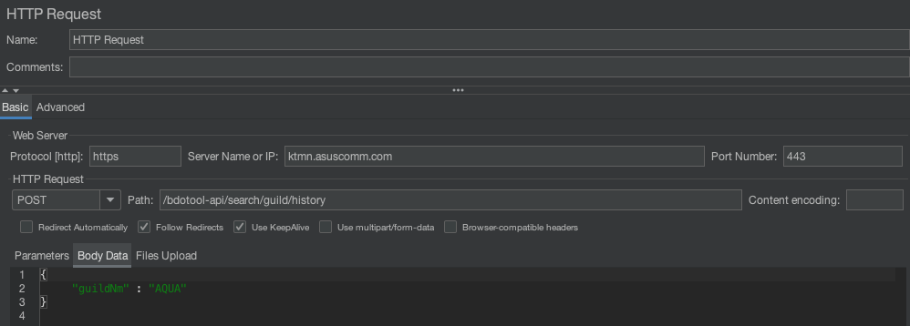

# Apache Jmeter 설치 및 사용법(Mac)

## Apache Jmeter란?
특정 서버가 제공하는 서비스에 대한 성능을 측정하고 사용자에게 보여주는 테스트 도구.

## 설치법(Mac)
1. Apache Jmeter 설치 w/ homebrew
    ```zsh
    brew install jmeter
    ```
2. Jmeter 설치 경로 이동
    ```zsh
    cd /opt/homebrew/Cellar/jmeter/5.6.3/bin
    ```
3. Jmeter 실행
    ```zsh
    ./jmeter
    ```

## 사전 플러그인 설치
1. Options > Plugin Manager 진입
2. Available Tab 선택
3. 다음 플러그인들을 설치:
    - 3 Basic Graphs
    - Custom Thread Groups

## 사용법
### Simple http request traffic
1. Test Plan 우클릭: Add -> Threads(Users) -> Thread Group
2. Thread Group 우클릭: Add -> Sampler -> Http Request
    - Request 내용 입력 예시: POST 타입의 api (https protocol 기준)
    
3. Thread Group 우클릭: Add -> Listener -> View Results Tree
4. Thread Group 우클릭: Add -> Listener -> Summary Report
5. Thread Group 우클릭: Add -> Listener -> Transactions Per Second (jp@gc)
6. Thread Group 우클릭: Add -> Config -> HTTP Header Manager
    - 헤더값을 추가할 수 있는데, application/json 타입의 Content-Type 지정이 필요할 시 사용한다.
7. Thread Group 내 설정값 적용
    - Number of Threads (users): 트래픽 수
    - Ramp-up period (seconds): 한번의 실행을 몇 초 동안 수행할 것인지에 대한 설정값
    - Loop Count: 반복 횟수, Infinite를 누르면 무제한 실행
8. 실행(Run) 후 결과값 확인
