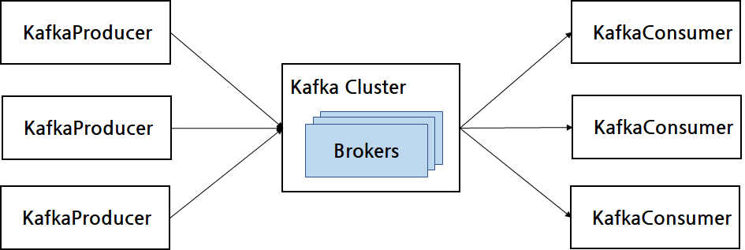

# Apache Kafka 사용법

## Kafka란?

- 분산 데이터 스트리밍 플랫폼
- 주요 특징
  - 분산 메세지 큐: Topic 단위로 메세지 큐를 구성되며, 해당 Topic은 여러 파티션 분할이 가능하고 여러 브로커(서버)에서 처리할 수 있음
  - 내구성과 확장성: 데이터를 안전하게 저장, 복제를 하여 내구성을 확보하고, 손쉬운 브로커 추가를 통한 확장을 이룰 수 있음
  - 이벤트 스트리밍
  - 대용량 데이터 처리
  - 높은 성능
  - 다양한 클라이언트 지원

## Apache Kafka CLI source 다운로드
```bash
sudo apt-get update
sudo apt-get install openjdk-11-jre # java 실행환경 설치
wget https://downloads.apache.org/kafka/3.6.0/kafka-3.6.0-src.tgz # 작성 기준 최신 안정화 버전: 3.6.0
tar -xzf kafka-3.6.0-src.tgz
```

## 입문: CLI 기반 Kafka 사용법
0. 실행 쉘 스크립트들이 위치한 bin 디렉토리로 이동
```bash
cd kafka-3.6.0-src.tgz # kafka 압축 해제 디렉토리 이동
cd bin # 실행파일 저장 디렉토리 이동
```

1. Zookeeper 실행(새 bash shell에서)
```bash
./zookeeper-server-start.sh ../config/zookeeper.properties # zookeeper 설정 파일을 바탕으로 zookeeper서버 실행
```

2. Kafka 서버 실행(새 bash shell에서)
```bash
./kafka-server-start.sh ../config/server.properties # kafka 설정 파일을 바팡으로 kafka서버 실행
```

3. Kafka topic 생성(새 bash shell에서)
```bash
./kafka-topics.sh --create --topic test_topic --partitions 1 --replication-factor 1 --bootstrap-server localhost:9092
```

4. 생성한 topic을 기반으로 Producer 실행
```bash
./kafka-console-producer.sh --topic test_topic --bootstrap-server localhost:9092
```
  이후 하단에 나오는 입력창에서 타이핑을 진행할 시 cache에 저장됨.  

5. 생성한 topic을 기반으로 Consumer 실행(새 bash shell에서)
```bash
./kafka-console-consumer.sh --topic test_topic --from-beginning --bootstrap-server localhost:9092
```
  이후 여태까지 입력해 두었던, 이벤트 메세지들이 처음부터 출력되며 실시간 Producer-Consumer 통로가 생성됨.  

6. Topic 삭제 방법
```bash
./kafka-topics.sh --delete --topic test_topic --bootstrap-server localhost:9092
```

etc. Topic 정보 조회
```bash
./kafka-topics.sh --describe --topic test_topic --bootstrap-server localhost:9092
```

### server.properties
- `./kafka-server-start.sh` 실행에 필요한 서버 설정 파일.
- Kafka 서버는 Kafka 브로커라고도 불린다. (word used interchangably)
- 해당 서버 설정 파일의 핵심 요소:
  - `broker.id`: 브로커 별 id 번호 부여. unique 값을 가져야 한다.
  - `listeners`: 수신 포트 주소 매핑에 사용. 포트 번호가 unique 해야한다.
    - listeners 설정을 통해 지정된 포트가 있을 시, `port` 설정을 덮고 우선시 되어 지정된 포트로 브로커가 구성된다.
    - ex) `listeners=PLAINTEXT://localhost:9096` 진행 시 브로커의 port도 9096으로 구성된다.
  - `log.dirs`: 로그 파일 경로. unique 값을 가져야 한다.

### kafka cluster의 개념
- kafka 시스템의 단위
- zookeeper, brokers 등등을 모두 합쳐 아우르는 단위
- 실제 상용 kafka의 경우 여러 머신에 나뉘어져 분배되어 있는 브로커들을 활용함
- 위 실습 과정에서는 single-node kafka cluster 구조로, 단일 브로커만 존재하는 형태이나 하나의 kafka cluster라고 볼 수 있음

### `--bootstrap-server` 옵션의 의미
- 위 옵션의 후속 param 값으로 받는 주소(ex. localhost:9092)는 초기 연결 브로커를 의미한다.
  - `--bootstrap-server localhost:9092`의 경우 localhost의 9092번 포트에 구성된 브로커가 초기 브로커가 된다.
  - 초기 브로커를 통해 kafka cluster로 접근하게 된다.
  - 처음 kafka cluster에 연결된 이후에는, cluster를 통해 모든 브로커에 접근할 수 있다.
    - kafka cluster의 주요 기능으로서 로드밸런싱과 부하 조절을 해내기 위해 가용 가능한 브로커를 실시간으로 배치하게 된다.
> 결론: 초기 브로커 연결을 지정할 때 사용되는 옵션이며, 초기 연결 이후부터는 가용가능한 브로커가 실시간 배치된다.

## Kafka 관리

### 서버 백그라운드 실행
- `nohup` 사용을 통한 백그라운드 실행
  - zookeeper 서버와 kafka 브로커를 모두 실행해야하는 환경에서, 터미널을 킨 채로 실행 시 터미널 종료와 동시에 프로세스가 종료된다.
  - 따라서, nohup를 활용하여 백그라운드로 지속적으로 실행되도록 구현한다.
  - `nohup ./zookeeper-server-start.sh ../config/zookeeper.properties > /home/A82273950/logs/zookeeper.log 2>&1 &`
    - zookeeper.log 로그 파일에 서버 로그 실시간 저장
    - 2>&1: standard error, standard output 모두 저장
    - &: 백그라운드 실행

### 프로세스 확인
- nohup 실행 시 프로세스 id 값이 출력 됨.
- 해당 프로세스 id를 기록해 두지 않는 한, 추후 종료 필요 시에 프로세스 id를 거꾸로 파악하는 과정이 필요함.
- `ps aux | grep <프로세스 실행파일 이름; ex) zookeeper>`: 특정 프로세스의 정보를 출력.

### 프로세스 종료
- `kill <ps id>`: 해당 프로세스 id값에 해당하는 프로세스를 시그널을 통한 정상 종료 시도.
- `kill -9 <ps id>`: 정상 종료가 진행되지 않을 경우 강제종료

### 포트 점유 확인
- `netstat -tuln | grep <포트번호>`: 포트번호에 해당하는 포트 점유 상황 출력.
- 프로세스 관련 로그에서, 어떤 포트를 사용하는지 bind 정보를 로그를 통해 확인하는 방법도 존재. 하지만 로그와 다르게 점유 상황이 다를 수 있으므로, netstat을 통해 실시간 점유 현황을 파악하는 것이 좋다.

## 심화: Multi-device Kafka 구성 및 사용법

### 목표
- 3대의 서버 중 2대를 Kafka Cluster 구성에 사용, 1대는 테스트 접근 용도로 구성
  - 편의상 3대의 서버를 각각 Device 0, Device 1, Device 2로 지칭.
  - Device 0: Kafka master device로 구현
    - Zookeeper server 구동
    - Kafka broker 구동 (Broker 0)
  - Device 1: Kafka broker device로 구현
    - Device 0의 Zookeeper server에 연결하여 Kafka cluster에 합류
    - Kafka broker 구동 (Broker 1)
  - Device 2: 단순 Kafka producer 혹은 consumer로 접근하여 이벤트 주고 받는 테스트 수행 목적의 서버
- Device 0와 Device 1으로 Kafka cluster를 구현하고, Device 2에서 producer로 kafka broker를 활용하여 kafka cluster에 접근하여 메세지를 발송.
- Device 0이나 Device 1의 broker를 통해 consumer를 구동하여 producer가 보낸 메세지를 수신하여 kafka 정상 작동 여부를 파악

### 구현 순서
0. 모든 서버에 필수 요소 설치 및 준비
  - Kafka cli binary source를 [다운로드](https://kafka.apache.org/downloads) 받기
    - 유의사항: binary 파일이 아닌 src 파일의 경우 classpath가 없어 빌드가 필요함. scala 2.13 버전의 binary 파일을 내려받는 것을 추천.
    - 폐쇄망 서버의 경우 wget을 통한 다운로드가 안되므로, ftp 등을 통해 kafka 실행 파일을 전송할 수 있도록 할 것.
  - Kafka 구동에 필요한 Java Development Kit 설치(JRE도 가능)
  - Kafka 버전과 Java 버전이 호환되도록 구현

1. (Device 0) Zookeeper 서버 구동
```bash
cd <kafka src 압축해제 경로> # kafka 소스파일이 압축해제된 경로로 이동
mkdir ~/logs/ # nohup 사용에 따른 로깅 파일을 저장할 디렉토리 생성
nohup ./bin/zookeeper-server-start.sh ../config/zookeeper.properties > ~/logs/zookeeper.log 2>&1 & # nohup 사용을 통해 현 터미널 종료 필요 없이 백그라운드로 프로세스 구현.
```
- nohup 사용을 하여 백그라운드로 프로세스를 구동하고, 터미널 종료시에도 kafka 작동이 가능토록 함.

2. (Device 0) Kafka broker 0 구동 전 server.properties 수정
- `broker.id`: id 값을 0으로 지정 (default: 0)
- `listeners`: 외부 device에서 접근이 가능할 수 있도록, ip를 명시해야 함.
  - `listeners=PLAINTEXT://<Device 0 IP>:9092`
- `zookeeper.connect`: 주소 값을 `localhost:9092`로 하여 Device 0의 zookeeper에 연결되도록 구현

3. (Device 0) Kafka broker 0 구동
```bash
cd <kafka src 압축해제 경로>
nohup ./bin/kafka-server-start.sh ../config/server.properties > ~/logs/broker0.log 2>&1 &
```

4. (Device 1) Kafka broker 1 구동 전 server.properties 수정
- `broker.id`: id 값을 1로 지정 (default: 0)
- `listeners`: 외부 device에서 접근이 가능할 수 있도록, ip를 명시해야 함.
  - `listeners=PLAINTEXT://<Device 1 IP>:9092`
- `zookeeper.connect`: 주소 값을 device 0의 zookeeper server에 연결하기 위하여 `<Device 0 IP>:2181`로 입력

5. (Device 1) Kafka broker 1 구동
```bash
cd <kafka src 압축해제 경로>
nohup ./bin/kafka-server-start.sh ../config/server.properties > ~/logs/broker1.log 2>&1 &
```

6. (Device 0 or Device 1) Kafka topic 생성
- partitions: 1
- reflection-factor: 1
```bash
cd <kafka src 압축해제 경로>
./bin/kafka-topics.sh --create --topic test_topic --partitions 1 --reflection-factor 1 --bootstrap-server <Device 0 or Device 1 IP>:9092
```

7. (Device 2): Kafka producer 구동
```bash
cd <kafka src 압축해제 경로>
./bin/kafka-console-producer.sh --topic test_topic --bootstrap-server <Device 0 or Device 1 IP>:9092
```

8. (Device 0 or Device 1) Kafka consumer 구동
```bash
cd <kafka src 압축해제 경로>
./bin/kafka-console.consumer.sh --topic test_topic --bootstrap-server <Device 0 or Device 1 IP>:9092 --from-beginning
```

9. 7번에 구현했던 Kafka producer로 메세지 전송 시 8번의 consumer 출력값 확인