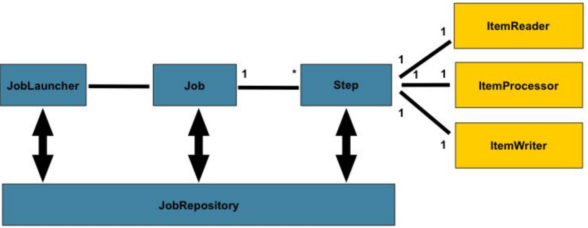
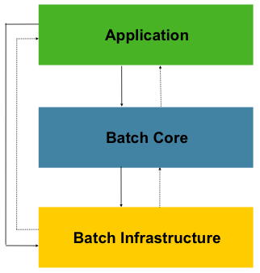
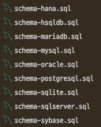

# Spring Batch 5

## 1. Batch Process의 정의
- 컴퓨터가 주기적으로 대량의 반복적인 데이터 작업을 완료하기 위해 사용하는 방식.
> 하루 종일 주문을 수신하는 전자 상거래 시스템에서, 주문을 그때그때 처리하지 않고 하루가 끝날 때 모든 주문을 수집하고 처리한다면? Batch process!

## 2. Spring Batch 5 사용 이유
- 자원 활용 및 데이터 프로세싱의 최적화를 통한 빠른 배치 프로세스 수행.
- 예외 처리에 따른 별도의 작업 수행 지정 가능.
- Spring 생태계와 높은 호환성. (ex. Spring Boot, Spring Data JPA 등)
- Java 언어.

## 3. Spring Batch Architecture
### 3.1. Domains

- JobLauncher: Job을 실행시키는 컴포넌트.
- Job: 배치 작업의 단위.
- Step: 작업의 세부 단계의 단위.
- JobRepository: Job의 실행과 결과, 상태 등을 저장.
- ItemReader, ItemProcessor, ItemWriter: 데이터를 읽고(read), 가공하고(process), 저장(write)한다.
	- Tasklet을 구성하는 것들이며, ChunkOrientedTasklet의 경우 reader+processor+writer를 별도로 구성한다.  
### 3.2. Layers

#### 3.2.1. Application Layer
- 개발자의 코드.
#### 3.2.2. Batch Core Layer
- Batch core runtime class들의 집함.
	- JobLauncher, Job, Step 등
#### 3.2.3. Batch Infrastructure
- Batch Core Framework와 개발자 모두가 사용하는 영역.
	- ItemReader, ItemWriter, Services 등

## 4. 프로젝트 도입 방법
### 4.1. 수행 환경
- Spring Boot v3.2.4
- Java 17
- Spring Batch v5.1.1
- Gradle-Groovy
- MariaDB v11.0.2
#### 4.1.1. build.gradle
```gradle
plugins {
    id 'java'
    id 'org.springframework.boot' version '3.2.4'
    id 'io.spring.dependency-management' version '1.1.4'
}

group = 'com.xronocore'
version = '0.0.1-SNAPSHOT'

java {
    sourceCompatibility = '17'
}

configurations {
    compileOnly {
        extendsFrom annotationProcessor
    }
}

repositories {
    mavenCentral()
}

dependencies {
    implementation 'org.springframework.boot:spring-boot-starter-batch'
    implementation 'org.springframework.boot:spring-boot-starter-data-jpa'
    implementation 'org.springframework.boot:spring-boot-starter-web'
    compileOnly 'org.projectlombok:lombok'
    developmentOnly 'org.springframework.boot:spring-boot-devtools'
    runtimeOnly 'org.mariadb.jdbc:mariadb-java-client'
    annotationProcessor 'org.projectlombok:lombok'
    testImplementation 'org.springframework.boot:spring-boot-starter-test'
    testImplementation 'org.springframework.batch:spring-batch-test'
}

tasks.named('test') {
    useJUnitPlatform()
}
```
#### 4.1.2. application.yml
```yaml
spring:
  profiles:
    include:
      - env
  datasource:
    driver-class-name: org.mariadb.jdbc.Driver
    url: ${maria-url}
    username: ${maria-username}
    password: ${maria-password}
  jackson:
    time-zone: Asia/Seoul
  jpa:
    hibernate:
      naming:
        physical-strategy: org.hibernate.boot.model.naming.PhysicalNamingStrategyStandardImpl
    properties:
      hibernate:
        show_sql: false
  batch:
    job:
      enabled: false
		jdbc:
			initialize-schema: never
```
- `batch.job.enabled: false`를 통해 Spring Boot Application 구동 시 batch job을 자동으로 감지 및 실행하지 않도록 함.
### 4.2. 유의사항
- `@EnableBatchProcessing` 어노테이션이 v5.x부터 필수가 아닌 지양이 되었다.
	- 사용 시 기본 Spring Boot 설정이 back-off 처리되어 각종 configuration을 직접 수행해야 한다.
- Spring Batch는 meta table이 있어야 작동한다.
	- meta table은 주어진 데이터베이스에 기록 및 저장을 위해 사용되는 테이블들로, 반드시 존재해야만 Spring Batch가 정상적으로 작동한다.
	- `spring.batch.jdbc.initialize-schema`는 never로 설정하여 meta table 자동 생성을 막는다.
	- batch 라이브러리(org.springframework.batch::spring-batch-core)의 spring-batch-core.5.x.x.jar 내부 org.springframework.batch.core package 내부에 schema-{schema 종류}.sql이 존재한다.
		- ex: MariaDB를 사용하는 경우 schema-mariadb.sql을 이용하여 meta table들을 생성하여 사용하면 된다.
		
### 4.3. 1개의 Batch를 만드는 일련의 과정
#### 4.3.1. ItemReader 작성
- ItemReader에는 많은 종류의 Reader가 있다. 각각 성능과 thread-safe 여부가 다르다.
[Item Readers 종류 - Ref. docs](https://docs.spring.io/spring-batch/reference/appendix.html#itemReadersAppendix)
#### 4.3.2. ItemProcessor 작성
#### 4.3.3. ItemWriter 작성
#### 4.3.4. Step 작성
#### 4.3.5. Job 작성


## 참조
[Spring Batch - 아키텍처[Website]](https://velog.io/@hyun6ik/Spring-Batch-%EC%95%84%ED%82%A4%ED%85%8D%EC%B2%98)