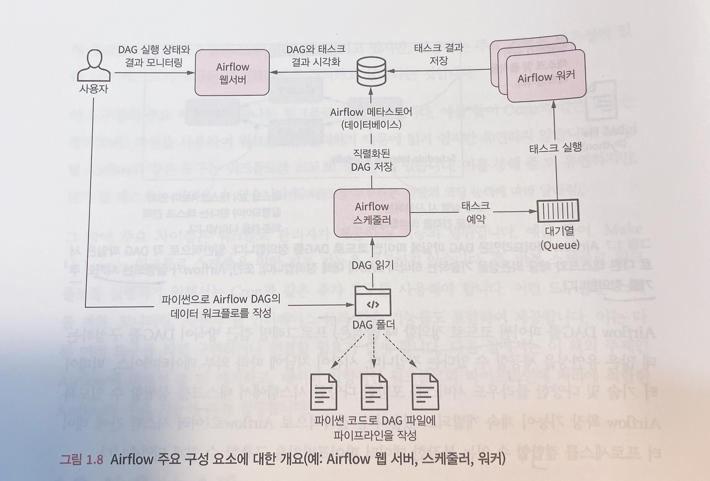

# Apache Airflow 사용법

## Airflow란?
워크플로우 오픈소스 플랫폼으로, 의존성으로 연결된 작업(Task)들의 집합을 관리하는 플랫폼이다.  
프로그래밍 방식으로 워크플로우를 작성, 예약하고 모니터링 하는데에 사용된다.

### DAG (Directed Acrylic Graph)
- 순환하지 않는 그래프
- 반복이나 순환을 허용하지 않음
- 순차적으로 작업(task)이 이루어지며, 순환 실행을 방지함.
- 논리적 오류는 교착상태(deadlock)로 이어진다.

### Operator
- Operator(task)를 정의하는데에 사용된다.
- 세 Type이 있다:
  - Action Operators
    - 기능이나 명령을 실행하는 Operator
    - 실제 연산을 수행하고, 데이터 추출 및 프로세싱 등에 관여
    - BashOperator, PythonOperator, EmailOperator 등이 내장되어 있다.
  - Transfer Operators
    - 하나의 시스템을 다른 시스템으로 옮김: from Source to Destination
    - 전달 목적으로 사용됨. ex) Presto to MySQL
  - Sensor Operators
    - 조건이 만족할 때 까지 기다렸다가, 조건이 충족될 시 다음 Task로 실행시키는 Operator

### Task
- Task: 데이터 파이프라인에 존재하는 Operator를 의미
  - Operator를 실행하면 Task가 된다.
- Task Instance: 데이터 파이프라인이 Trigger되어 실행된 Task를 Task instance라고 한다.
- Task 실행 순서 정의:
  - 오른쪽 시프트 연산자(binary right shift operator; >>)를 사용하여 task의 의존성을 정의한다.
  - ex) `Task1 >> Task2 >> Task3`: 1, 2, 3 순으로 수행
  - ex2) `[Task1, Task2] >> Task3`: 1과 2가 완료되면 3가 수행. 1과 2 둘중 하나라도 완료되지 않으면 3이 수행되지 못함.

### Airflow Component

- Webserver: 웹 대시보드 UI를 제공하며, DAG의 시각화와 실행 및 결과를 확인할 수 있는 인터페이스를 제공
- Scheduler: DAG의 분석과 스케쥴링을 담당. 스케쥴에 따라 airflow worker에 DAG Task를 예약한다.
- Worker: 예약된 Task를 실제로 실행시키는 담당.
- Metastore: airflow에 있는 DAG, Task등의 메타데이터를 관리. 데이터베이스에 해당하며, 해당 데이터베이스를 바탕으로 Webserver에 시각화할 데이터를 제공.
- Executor: Task 실행의 정의를 담당.

### Airflow 동작 순서

1. 사용자가 DAG를 작성하여, dags 폴더 안에 파일(보통 python 파일) 배치
2. Web Server와 Scheduler가 파싱하여 읽음
3. Scheduler가 Metastore를 통해 DagRun Object를 생성
  - DagRun은 사용자가 작성한 DAG의 인스턴스; `DagRun Status : Running`
4. Scheduler가 Task Instance Object를 스케줄링
5. Trigger가 상황이 맞을 시 Scheduler가 Task Instance를 Executor로 보냄
6. Executor가 Task Instance를 실행
7. Executor가 완료 후, Metastore에 완료 보고
  - 완료된 Task Instance는 DagRun에 업데이트됨
  - Scheduler는 DAG 실행이 완료되었는지 Metastore를 통해 확인 후, DagRun의 상태를 완료로 바꿈(`DagRun Status : Completed`)
8. Metastore가 Webserver에 업데이트해서 사용자도 시각적으로 확인

## Airflow 구성법(With Docker in Ubuntu)
1. docker와 docker-compose 설치
  ```bash
  sudo apt-get install docker.io
  sudo apt-get install docker-compose
  ```
2. pip3와 apache-airflow 설치
  ```bash
  sudo apt-get install python3-pip
  pip3 --version // 설치 확인 및 버전 체크
  pip3 install apache-airflow
  ```
3. airflow용 workspace 생성
  ```bash
  mkdir -p airflow/{dags,logs,plugins} // 띄워쓰기 없음에 주의. airflow 폴더 하위에 3개의 폴더를 생성
  cd airflow
  ```
4. airflow 디렉토리 안에 진입하여, env 파일 생성
  ```bash
  echo -e "AIRFLOW_UID=$(id -u)" > .env
  ```
  - 이는 Linux 상에서 host user id를 알아야 airflow가 정상적인 권한으로 동작하도록 설계되어 있기 때문이다. 이 설정이 없을 시 root로 지정되어 권한 부족에 따른 실행 종료가 발생할 수 있음.
5. 공식 docker-compose.yaml 파일을 다운로드
  ```bash
  curl -LfO 'https://airflow.apache.org/docs/apache-airflow/2.7.1/docker-compose.yaml' // 2.7.1 버전이 명시되어 있으나, 사용하고자 하는 airflow 버전에 맞게 변경할 것.
  ```
6. DB 초기화 작업 수행
  ```bash
  docker-compose up airflow-init
  ```
7. airflow 실행
  ```bash
  docker-compose up
  ```

이후 airflow 관련 명령을 cli로 내릴 때에는 docker의 각 서비스에서 명령을 실행해야 한다:  
`docker-compose run airflow-worker airflow info`  
이것이 번거로울 시 래핑된 shell script를 사용할 수 있다:
`curl -LfO 'https://airflow.apache.org/docs/apache-airflow/2.7.1/airflow.sh'`  
를 통해 다운로드 받고, 권한을 부여한 뒤  
`./airflow.sh info`로 동일한 명령을 간단하게 수행할 수 있다.  

## Airflow 웹페이지 접속 방법
1. 기본 구성된 서버의 주소에 포트를 8080을 붙혀 접속하면 된다.
2. 초기 ID와 비밀번호는 `airflow` 이다.

## 예시 DAG
```python
from airflow import DAG
from airflow.operators.python import PythonOperator
from datetime import datetime

# Define default arguments
default_args = {
    'owner': 'your_name',
    'start_date': datetime(2023, 10, 10),
    'retries': 1,
}

# Create the DAG instance
dag = DAG(
    dag_id='my_simple_dag',
    default_args=default_args,
    schedule_interval=None,  # You can specify a schedule interval here (e.g., '0 0 * * *' for daily).
)

# Define the Python function to be executed as a task
def my_python_function():
    print("Hello, Airflow!")

# Create a PythonOperator task
my_task = PythonOperator(
    task_id='my_task',
    python_callable=my_python_function,
    dag=dag,
)

# Optional: Define task dependencies (e.g., if you have multiple tasks)
# Example: my_task2 = ...
# my_task.set_downstream(my_task2)

```